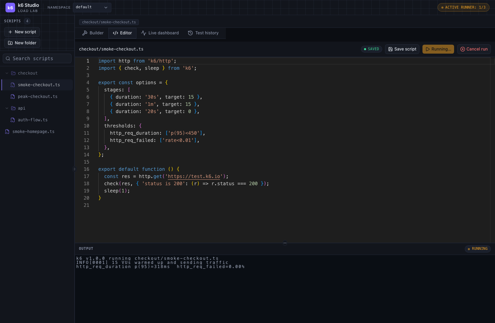
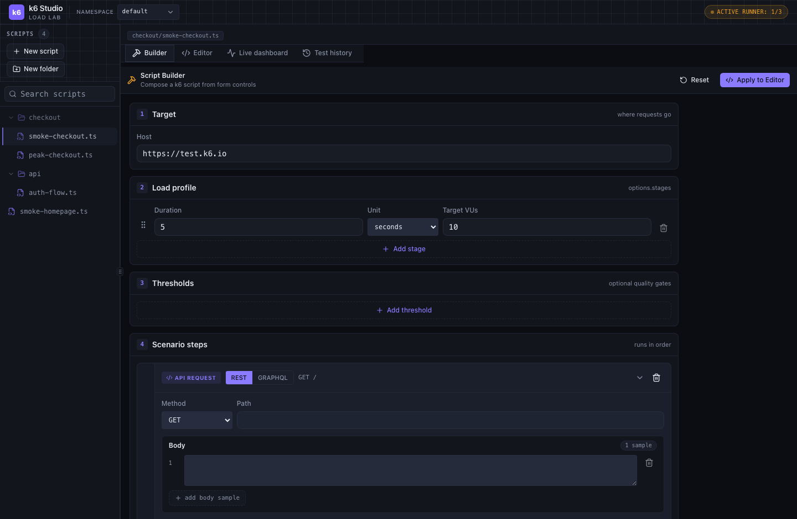
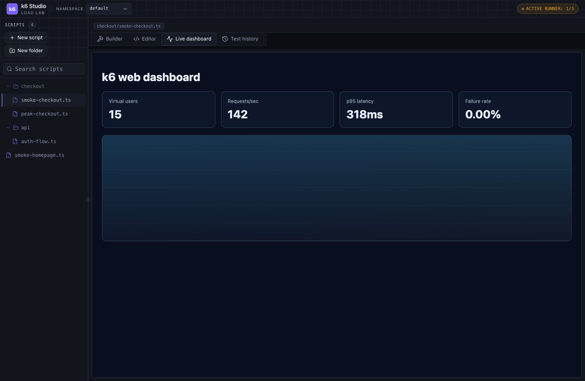
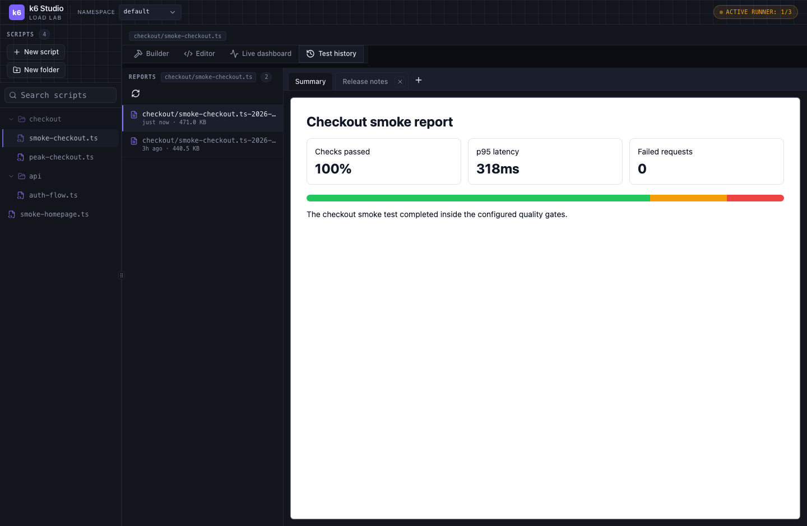

# k6 Studio Web Guide 🚀

k6 Studio Web is a browser-based load-testing workspace for writing, organizing,
running, and reviewing k6 scripts. It gives you a compact control-room UI for the
whole loop: script files, generated scripts, terminal output, live dashboard, and
test history in one place.



## Why Use It? ✨

- **One workspace for the whole load-test cycle**: browse scripts, edit code, run
  k6, watch output, and inspect reports without switching tools.
- **Namespace-aware organization**: keep scripts separated by team, project,
  environment, or experiment.
- **Browser-friendly script editing**: use the built-in editor for quick fixes,
  test variants, and saved scripts.
- **Form-based script building**: generate a k6 script from structured controls
  when you want a fast starting point.
- **Live visibility while tests run**: watch terminal logs and the k6 web
  dashboard during active runs.
- **Persistent history and notes**: review past reports and attach Markdown notes
  so investigation context does not disappear. 📝

## Quick Start ⚡

Start the local app and MinIO stack:

```bash
docker compose up --build -d
```

Open the app:

```text
http://localhost:3000/k6
```

For development without Docker, install dependencies and run the Next.js dev
server:

```bash
npm install
npm run dev
```

The app uses `/k6` as its base path, so the local web URL is still:

```text
http://localhost:3000/k6
```

## The Main Workflow 🧭

### 1. Pick A Namespace 🗂️

Use the namespace selector in the header to switch between workspaces. A
namespace owns its scripts, folders, reports, and notes. Use namespaces for
separating environments like `default`, `staging`, `checkout`, or team-specific
load-test suites.

When you need to add, rename, or delete namespaces, open **Manage namespaces**
from the selector. The default namespace is protected.

### 2. Find Or Create A Script 🔎

Use the file explorer on the left to:

- create folders
- create scripts
- search by script or folder name
- drag files and folders
- bulk-select items with Shift

Folders help keep large suites readable, for example:

```text
checkout/smoke-checkout.ts
checkout/peak-checkout.ts
api/auth-flow.ts
```

### 3. Edit And Save The Script 💾

Open a script from the file explorer. The editor tab gives you:

- TypeScript editing
- k6 type metadata
- save status
- save button
- run button
- cancel run button when a script is active
- terminal output below the editor

Use this path when you already know the exact k6 script you want to run.

### 4. Build A Script From Controls 🛠️

The **Builder** tab helps you compose a script from form controls.



Use the builder when you want a quick, consistent starting point:

- set the target host
- define load stages
- add thresholds
- add REST or GraphQL scenario steps
- add sample request bodies and headers

Click **Apply to Editor** to send the generated script into the editor. If the
current script was not generated by the builder, the app asks for confirmation
before overriding it.

### 5. Run The Test 🏃

From the editor tab, click **Run test**. While a run is active:

- the active runner count updates in the header
- the selected script shows terminal output
- **Cancel run** becomes available
- the live dashboard tab can display the running dashboard

The number of available runners is controlled by `TOTAL_RUNNERS`, with a default
of `1`.

### 6. Watch The Live Dashboard 📈

Open **Live dashboard** during an active run to see the k6 web dashboard inside
the app.



The dashboard is tied to the running script. If another script is running, select
that script first or use the active runner menu in the header to jump to it.

### 7. Review Test History 📚

After completed runs, open **Test history** for the selected script.



The left side lists reports for that script. The right side shows:

- pinned summary tab
- saved HTML report preview
- optional Markdown note tabs
- image paste support inside notes

Use notes for release observations, incident links, threshold decisions, or
follow-up tasks. 🎯

## Practical Tips 🌟

- Use folders for scenario groups, not just ownership. For example:
  `checkout/`, `search/`, `api/`, and `admin/`.
- Keep smoke scripts short and fast, then create separate peak or soak scripts.
- Put important thresholds directly in the script so failures are visible in
  both terminal output and reports.
- Use namespaces to isolate experimental scripts from stable scripts.
- Save investigation notes on the report itself so future readers know what the
  numbers meant.
- Share URLs from the browser address bar. The app path preserves namespace,
  selected script, active view, report, and report tab context.

## Troubleshooting 🧯

### The App Opens But Scripts Do Not Load

Check that MinIO is running and the app has the right S3-compatible settings:

```text
AWS_S3_BUCKET
AWS_S3_ENDPOINT
AWS_S3_ACCESS_KEY
AWS_S3_SECRET_KEY
AWS_S3_USE_SSL
```

### The Live Dashboard Is Empty

The live dashboard only appears while the selected script is actively running.
If the header shows active runners, click the active runner label and jump to the
running script.

### A Run Cannot Start

Check runner capacity. If all runners are busy, wait for one to finish or set a
higher `TOTAL_RUNNERS` value. The app supports up to 20 runners.

### Kubernetes Pod Restarts During A Run

k6 can use meaningful memory during active tests. Check the pod memory limit and
raise it if runs are being OOM-killed.

## Useful Commands 🧰

```bash
npm run dev
npm run build
npm run lint
npx jest
npx tsc --noEmit
docker compose up --build -d
```

## Screenshot Refresh 📸

This guide's screenshots can be regenerated locally:

```bash
node scripts/capture-guide-screenshots.mjs
```

The script starts a temporary local dev server, mocks deterministic app data in
Playwright, writes fresh `guide-*.png` files under `images/`, and shuts the
server down automatically.

## Summary 🎉

k6 Studio Web is useful when you want the speed of a local/internal load-testing
tool with the convenience of a full browser workspace. It keeps script authoring,
execution, live visibility, and report review close together, so teams can move
from "let's test this" to "here is what happened" with less friction.
